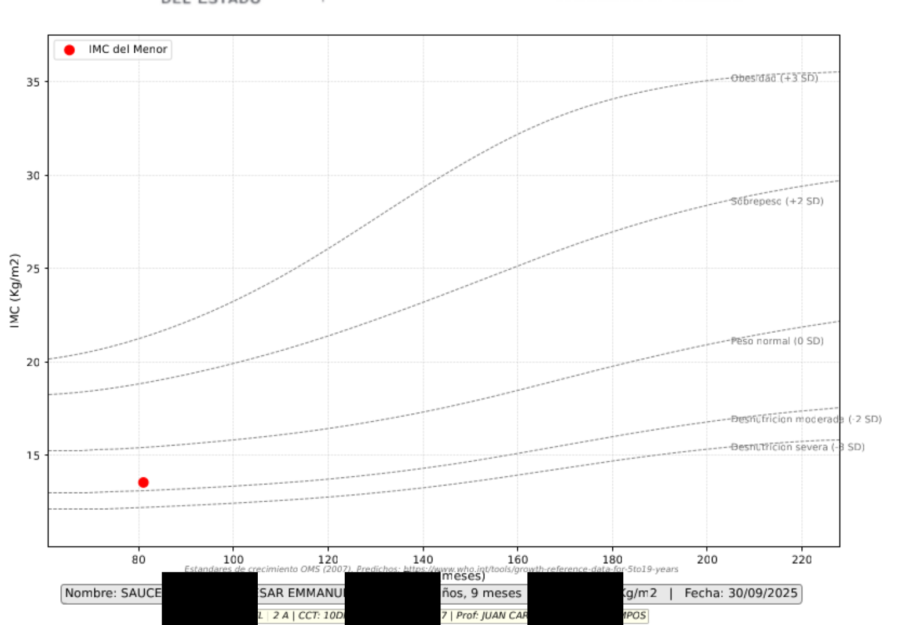
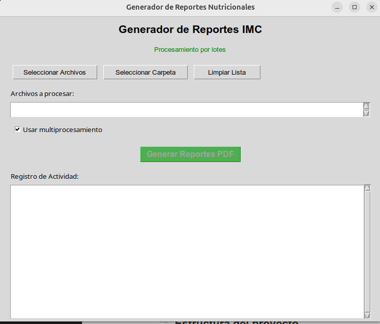
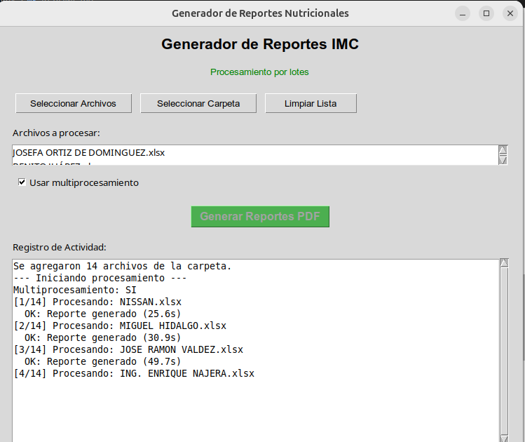

# GMRN - Generador Masivo de Reportes Nutricionales

Sistema para generar reportes individuales de IMC para menores escolares. Proyecto colaborativo entre la Subdirección de Educación Física A (SEED) y el Departamento de Enfermedades Transmisibles (SSD) del estado de Durango.

## Qué hace

Procesa datos de somatometría de aprox. 63,000 menores (6-12 años) del subsistema federal y genera PDFs individuales de 3 páginas:

1. Gráfica de crecimiento OMS (IMC vs edad)

   
2. Cartilla de salud escolar con datos del alumno
3. Hoja de referencia para derivación a centros de salud

El sistema permite a profesores de educación física y personal de salud identificar rápidamente casos que requieren seguimiento (desnutrición, sobrepeso, obesidad).

## Instalación

```bash
git clone [repo]
cd GMRN
python -m venv .venv
source .venv/bin/activate  # En Windows: .venv\Scripts\activate
pip install -r requirements.txt
```

## 🤝 Instalación para Colaboradores

Debido a la sensibilidad de los datos (información personal de menores), la carpeta `data/` **NO está incluida en el repositorio**. Si eres un colaborador autorizado:

1.  Solicita el archivo `data.zip` al administrador del proyecto.
2.  Descomprímelo en la raíz del proyecto para tener esta estructura:

```text
GMRN/
├── .venv/
├── src/
├── data/              <-- CARPETA EXTERNA
│   ├── raw/           # Aquí va el Excel maestro "IMC FEDERAL.xlsx"
│   ├── processed/     # Se generará automáticamente
│   └── references/    # Tablas OMS (bmi-boys/girls-z-who-2007-exp.xlsx)
```

### Diccionario de Datos (Estructura Excel)

El archivo de entrada (Raw) debe contener las siguientes columnas para que el sistema funcione:

| Columna | Requerido | Descripción |
| :--- | :---: | :--- |
| **NOMBRE_ALU** | ✅ | Nombre completo del menor |
| **MESES** | ✅ | Edad en meses al momento de la medición |
| **IMC** | ✅ | Índice de Masa Corporal calculado |
| **GÉNERO** | ✅ | "M", "MASCULINO", "F" o "FEMENINO" |
| **PERCENTILES** | ⚠️ | Necesario para script de filtrado (`<15` o `>85.1`) |
| **ZONA_EF** | ⚠️ | Necesario para dividir archivos por zona |
| **ESCUELA** | ⚠️ | Necesario para dividir archivos por escuela |
| **PESO_Kg** | ⚪ | Dato clínico (opcional pero recomendado) |
| **TALLA_Mts** | ⚪ | Dato clínico (opcional pero recomendado) |
| **FECHA_NAC** | ⚪ | Fecha de nacimiento |
| **FECHA_TAM** | ⚪ | Fecha del tamizaje (medición) |
| **CURP** | ⚪ | Identificador único |

*> ✅ = Obligatorio para generar PDF | ⚠️ = Obligatorio para filtrar/procesar | ⚪ = Opcional (aparece vacío si falta)*

## Uso básico

### 1. Procesar datos crudos

```bash
python src/process_data.py --input data/raw/IMC\ FEDERAL.xlsx --output-dir data/processed
```

Esto filtra los registros (percentiles < 15 o > 85.1) y los divide por zona/escuela.

### 2. Generar reportes PDF

```bash
python src/nutritional_app.py
```

Abre una interfaz gráfica donde puedes:

- Seleccionar archivos individuales o carpetas completas
  
- Activar/desactivar procesamiento paralelo
- Ver progreso en tiempo real

  

Para modo benchmark sin GUI:

```bash
python src/nutritional_app.py --benchmark data/processed/IMC_FILTERED.csv
```

## Estructura del proyecto

```
GMRN/
├── data/
│   ├── raw/              # Datos originales (Excel de zonas escolares)
│   ├── processed/        # Datos filtrados y divididos
│   └── references/       # Tablas OMS (bmi-boys/girls-z-who-2007-exp.xlsx)
├── src/
│   ├── process_data.py   # Script de filtrado y división
│   ├── nutritional_app.py # Generador de PDFs (GUI + batch)
│   └── logger.py         # Sistema de logs JSON
├── logs/                 # Logs de ejecución
└── requirements.txt
```

## Dependencias principales

- pandas - manejo de datos
- matplotlib - generación de gráficas
- openpyxl - lectura/escritura Excel
- pypdf - combinación de PDFs
- tkinter - interfaz gráfica (incluido en Python)

## Tecnología

Python 3.12+, matplotlib con backend Agg (no interactivo, más rápido), multiprocessing para paralelizar la generación de PDFs. Los logs se guardan en formato JSON línea por línea.

## Notas sobre la evolución del proyecto

Este código consolidó scripts que originalmente corrían manualmente en Google Colab durante 2 años. La versión inicial solo generaba gráficas individuales usando bucles secuenciales y requería subir archivos manualmente.

Principales mejoras desde la versión Colab:

- Ejecución local sin depender de internet
- Procesamiento por lotes (miles de registros)
- Paralelización con multiprocessing
- Generación de 3 páginas por menor (antes solo 1 gráfica)
- Interfaz GUI para facilitar uso por personal no técnico

Los datos se procesan offline y los PDFs se pueden imprimir directamente para entregar a padres/tutores.
